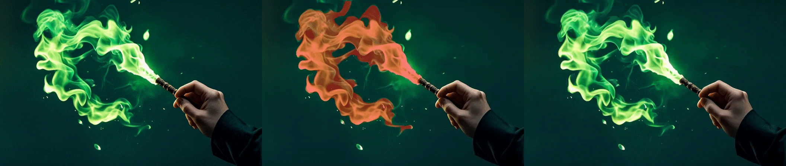

# Anonymous repository for paper submission: CVPR 2025, paper ID 7946

## Dragging

- In the following samples, we **drag the movable objects (both translation/rotation; both single/multiple objects)** in the input image:

<table>
  <tr>
    <th width=34% style="text-align:center">Input Image</th>
    <th width=32% style="text-align:center">Object Dragging</th>
    <th width=34% style="text-align:center">Result</th>
  </tr>
  <tr>
    <td colspan="3"></td>
  </tr>
  <tr>
    <td colspan="3"></td>
  </tr>
  <tr>
    <td colspan="3"></td>
  </tr>
  <tr>
    <td colspan="3"></td>
  </tr>
  <tr>
    <td colspan="3"></td>
  </tr>
</table>

## Camera Movement + Dragging

- In the following samples, we **move the camera and drag the movable objects** in the input image:

<table>
  <tr>
    <th width=34% style="text-align:center">Input Image</th>
    <th width=32% style="text-align:center">Camera & Object Movement</th>
    <th width=34% style="text-align:center">Result</th>
  </tr>
  <tr>
    <td colspan="3" ></td>
  </tr>
  <tr>
    <td colspan="3"></td>
  </tr>
  <tr>
    <td colspan="3"></td>
  </tr>
  <tr>
    <td colspan="3"></td>
  </tr>
  <tr>
    <td colspan="3"></td>
  </tr>
  <tr>
    <td colspan="3"></td>
  </tr>
  <tr>
    <td colspan="3"></td>
  </tr>
  <tr>
    <td colspan="3"></td>
  </tr>
  <tr>
    <td colspan="3"></td>
  </tr>
</table>

## Motion Brush for Movable Objects

In the following samples, we **brush a  mask for movable objects** in the input image and only set a scalar motion strength:

<table>
  <tr>
    <th width=34% style="text-align:center">Input Image</th>
    <th width=32% style="text-align:center">Brush Mask</th>
    <th width=34% style="text-align:center">Result</th>
  </tr>
  <tr>
    <td colspan="3" ></td>
  </tr>
  <tr>
    <td colspan="3"></td>
  </tr>
  <tr>
    <td colspan="3"></td>
  </tr>
  <tr>
    <td colspan="3"></td>
  </tr>
  <tr>
    <td colspan="3"></td>
  </tr>
  <tr>
    <td colspan="3"></td>
  </tr>
  <tr>
    <td colspan="3"></td>
  </tr>
</table>

## Motion Brush for Visual Effects

In the following samples, we **brush a  mask for fluids** in the input image and only set a scalar motion strength:

<table>
  <tr>
    <th width=34% style="text-align:center">Input Image</th>
    <th width=32% style="text-align:center">Brush Mask</th>
    <th width=34% style="text-align:center">Result</th>
  </tr>
  <tr>
    <td colspan="3"></td>
  </tr>
  <tr>
    <td colspan="3"></td>
  </tr>
  <tr>
    <td colspan="3"></td>
  </tr>
  <tr>
    <td colspan="3"></td>
  </tr>
  <tr>
    <td colspan="3"></td>
  </tr>
  <tr>
    <td colspan="3"></td>
  </tr>
  <tr>
    <td colspan="3" ></td>
  </tr>
</table>

## Comprehensive Usage for Creation

- We fix the foreground and dolly out the background, creating a Hitchcock-like camera movement effect.

<table>
  <tr>
    <th width=34% style="text-align:center">Input Image</th>
    <th width=32% style="text-align:center">Controls</th>
    <th width=34% style="text-align:center">Result</th>
  </tr>
  <tr>
    <td colspan="3"></td>
  </tr>
  <tr>
    <td colspan="3"></td>
  </tr>
</table>

